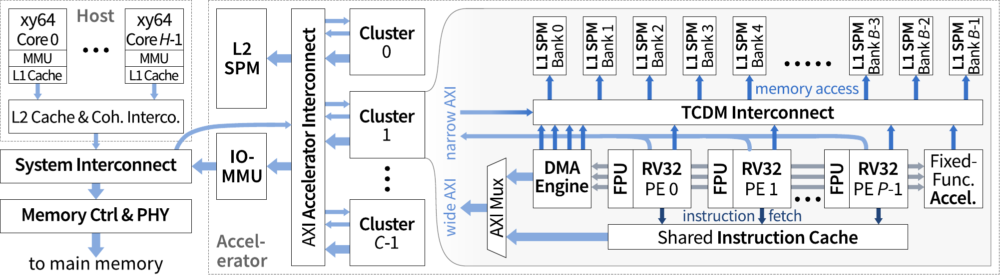
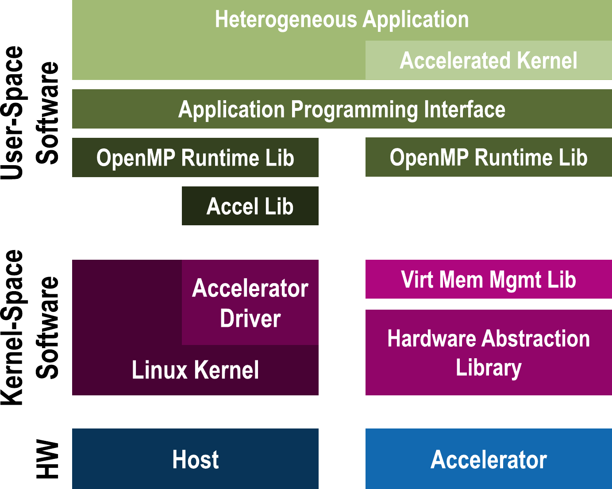

# Heterogeneous Research Platform (HERO)

HERO is an **FPGA-based research platform** that enables accurate and fast exploration of **heterogeneous computers** consisting of **programmable many-core accelerators** and an **application-class host CPU**.  Currently, 32-bit RISC-V cores are supported in the accelerator and 64-bit ARMv8 or RISC-V cores as host CPU.  HERO allows to **seamlessly share data between host and accelerator** through a unified heterogeneous programming interface based on OpenMP 4.5 and a mixed-data-model, mixed-ISA heterogeneous compiler based on LLVM.

HERO's **hardware architecture**, shown below, combines a general-purpose host CPU (in the upper left corner) with a domain-specific programmable many-core accelerator (on the right side) so that data in the main memory (in the lower left corner) can be shared effectively.


HERO's **runtime software stack**, shown below, seamlessly integrates accelerators (with their runtime stack on the right) into the OS running on the host (runtime stack on the left) to enable heterogeneous applications with transparent offloading of accelerated kernels (at the top).
<p align="center"></p>

All of HERO's software and most of its hardware (everything except the components of the Xilinx Zynq MPSoC) are available under **open-source licenses**.  This includes:
- cross compiler toolchains
- root file system configurations
- boot images
- Linux kernel configurations and drivers
- runtime libraries
- benchmarks
- OpenMP applications
- RISC-V cores
- on-chip memory controllers
- caches
- interconnects
- DMA engines
- IOMMU

**This repository** contains the source code for the top-level logic of HERO and many of its components.  The source code of other components, such as the Linux kernel and the cross compilers, is not directly stored in this repository.  Instead, that code is stored in other open-source repositories to which this repository links.

The most mature **implementation target** currently is Xilinx' ZCU102 featuring a Xilinx Zynq UltraScale+ MPSoC.  The 64-bit ARMv8 Cortex-A53 of the processing system (PS) serves as host CPU, and a multi-core 32-bit RISC-V accelerator is instantiated in the programmable logic (PL).

A second implementation target currently under development is Xilinx' VCU128, where a 64-bit RISC-V CVA6 host CPU and a multi-core 32-bit RISC-V accelerator are combined on an FPGA.

This repository is [published on GitHub](https://github.com/pulp-platform/hero), including all releases and the main branch.  As continuous integration and verification (partially) relies on commercial software and FPGA boards, it is hosted on servers of the maintainers.  For the same reason, issues are tracked there.  If you have questions or would like to provide feedback, please e-mail `hero (at) iis ee ethz ch` (replace the spaces in the domain name with dots).

The **design and architecture** of the components of HEROv2 are described in [**this paper** (preprint)](https://arxiv.org/abs/2201.03861). If you use our work in your research, please cite it.


## Getting Started

### Prerequisites

All build steps should work on any recent Linux distribution (we have automated tests on CentOS 7).  Most of the core dependencies are installed automatically as part of the toolchain.  Required is at least GCC 4.8 / Clang 3.3 to bootstrap the toolchain installation.
More details can be found [here](PREREQUISITES.md).

### External sources

HERO uses Git submodules that have to be initialized.  Either clone the repository recursively using
```
git clone --recursive <url>
```
or fetch the submodules afterwards in the repository
```
git submodule update --init --recursive
```

### Setup

All toolchains and SDKs are installed automatically to the location pointed to by the `HERO_INSTALL` environment variable.  Please set it to your preferred installation location before continuing with the next step
```
export HERO_INSTALL=<your_path>
```
We recommend you create an `install` subdirectory in this repository and set `HERO_INSTALL` to that.

If you want to build the HERO SDK and the board images with PREM support, please run
```
make prem-set
```
before continuing.  This writes the necessary commands to your local configuration file.  The command must be run before building the `sdk-h*`, `br-h*` targets.  To disable PREM, run
```
make prem-unset
```
and then rebuild your `sdk-h*` and `br-h*` targets.

PREM support is disabled by default, and no action is necessary to setup HERO without PREM support.  PREM has only been tested for `exilzcu102`, and is known to not work correctly with the `teams distribute` OpenMP construct.

### Toolchains

HERO has configurations for multiple base toolchains.  The project relies on Crosstool-NG for easily building the different toolchains.  The toolchains are installed to the `HERO_INSTALL` directory.

All heterogeneous installations require a toolchain for the PULP accelerator, which can be built with:
```
make tc-pulp
```

Furthermore, both Linux and bare-metal toolchains are available for both the RISC-V Ariane host and for the ARMv8 Cortex-A53 host.  These can be separately built as follows:
```
make tc-hrv-obare   # 64-bit RISC-V bare-metal toolchain
make tc-hrv-olinux  # 64-bit RISC-V Linux toolchain
make tc-har-obare   # 64-bit AArch64 bare-metal toolchain
make tc-har-olinux  # 64-bit AArch64 Linux toolchain
```
Current setups require only the Linux toolchains (`-olinux` suffix).

### PULP SDK

The PULP SDK is required to build applications for PULP.  This has to be set up before installing the HERO host SDKs because heterogeneous libraries rely on it.  The required configuration can be built with
```
make sdk-pulp
```

### Host SDKs

Host Software Development Kits (SDKs) for both RISC-V and ARMv8 are necessary for the infrastructure of further build steps, for the development of heterogeneous applications, and for development on the HERO software stack itself.  The SDKs are generated using Buildroot and installed to the `HERO_INSTALL` directory.  These SDKs can be built as follows:
```
make sdk-hrv  # SDK for RISC-V host
make sdk-har  # SDK for ARMv8 host
```

### Heterogeneous Toolchain

After the base toolchains and accelerator and host SDKs are installed, the HERO heterogeneous toolchain can be installed.  The heterogeneous toolchain is based on LLVM 12 and includes support in Clang and OpenMP to create heterogeneous applications for the HERO target platform.  The toolchain will be installed in the `HERO_INSTALL` toolchain folder together with the core toolchains and SDKs.  To build and install the LLVM toolchain, run:
```
make tc-llvm
```
(If you are working on ETHZ IIS machines, the default compiler is too old to build LLVM.  To fix this problem, you have to set two environment variables *before* building LLVM: `CC=/usr/pack/gcc-9.2.0-af/linux-x64/bin/gcc CXX=/usr/pack/gcc-9.2.0-af/linux-x64/bin/g++`.)

Note that the LLVM OpenMP target offloading plugin for PULP (i.e., `libomptarget.rtl.pulp.so`) is *not* compiled as part of LLVM.  Instead, it is compiled as package in the host SDK, because it must be compiled for a specific host architecture.  You can thus safely ignore the message `LIBOMPTARGET: Not building PULP offloading plugin: build disabled.`.

### Environments

With the toolchains and SDKs installed, the development environment for an implementation target can be created (see introduction for an overview of the implementation targets).  This section provides the instructions for each supported implementation target.

##### Xilinx ZCU102

A complete Linux environment with kernel and the base root filesystem for the ARMv8 host on the Xilinx Zynq UltraScale+ MPSoC ZCU102 can be built as follows.

First, add a line to the `local.cfg` file at the root of your repository (create that file if it does not exist), which defines the path to the bitstream:
```
BR2_HERO_BITSTREAM=/absolute/path/to/hero_exilzcu102_wrapper.bit
```
Then, generate the SD card image files with
```
make br-har-exilzcu102
```

This creates an SD card image from the Buildroot filesystem and additionally invokes PetaLinux to create bootable image files.  Due to security limitations in the latest XCZU9EG revisions, we currently have to use images generated by Xilinx PetaLinux to boot Linux.  When the images are generated, insert the SD card of the ZCU102 into your development workstation and

1. Initialize the SD card with a master boot record (MBR, also known as "DOS partition table") and create two partitions:
   1. FAT32 (`0xc`), 256 MiB, bootable
   2. Linux (`0x83`), remaining space
2. Format the first partition with `vfat` and the second partition with `ext4`.
3. Mount the first partition, copy `BOOT.BIN` and `image.ub` from `output/br-har-exilzcu102/images/` to the mounted partition, and unmount it.

The system can then be booted up after configuring the ZCU102 board jumpers to boot from the SD card.  On the first boot, change the U-Boot variables as described in issue #107.  To do this, plug a USB cable into the USB-UART port of the board, connect it to your workstation, and configure a serial terminal of your choice (such as `minicom` or `screen`) to access it.  Once Linux has booted, you can log in as `root` on the serial terminal without a password.

Next, we highly recommend to set up SSH access to the board, because:
- it makes transferring applications to the board much simpler than having to modify the SD card or transferring files over the serial terminal, and
- it means you can reserve the serial terminal to observe kernel messages.

To set up SSH access to the board:
1. set the password for the `root` user with `passwd`;
2. allow the `root` user to log in via SSH by removing `-w` from `DROPBEAR_EXTRA_ARGS` in `/etc/default/dropbear`; and
3. restart the `dropbear` SSH server with `/etc/init.d/dropbear restart`.

If your board is connected to an Ethernet network and has been able to obtain an IP address via DHCP (check with `ip addr`), you should now be able to log in to the board with `ssh root@<board-ip>` using the password you set.  If you reboot the board, you have to repeat those settings because you made them in the memory-backed root filesystem.  In the next step, we will set up a persistent filesystem.

The root filesystem mounted after boot is provided by PetaLinux.  It is loaded into memory during boot, and changes are not persisted to the SD card.  A persistent filesystem resides on the second partition of the SD card.  Linux will mount that partition at `/run/media/mmcblk0p2` during boot.  HERO comes with a script that runs during boot and that mounts
- `/run/media/mmcblk0p2/home` at `/home` to persist user data, and
- `/run/media/mmcblk0p2/etc/dropbear` at `/etc/dropbear` to persist SSH host keys.

Create those two directories on the SD card and manually mount them this time.  Then create the directory `/home/root/startup_scripts`.  Any executable placed in this directory will be run during boot (in alphanumeric order).  You can use this feature to make the SSH access setup permanent by creating two files:
```sh
cat > /home/root/startup_scripts/00_set_root_password << EOT
#!/bin/sh
echo "root:password_you_define" | chpasswd
EOT
cat > /home/root/startup_scripts/01_dropbear_allow_root_login << EOT
#!/bin/sh
sed -i -e 's/DROPBEAR_EXTRA_ARGS="-w"/DROPBEAR_EXTRA_ARGS=""/' /etc/default/dropbear
EOT
chmod +x /home/root/startup_scripts/*
```

A second limitation of the root filesystem provided by PetaLinux is that it does not include the HERO libraries.  With SSH access, however, you can easily unpack the HERO root filesystem generated by Buildroot on the SD card.   Run the following command on your development workstation inside the HERO repository:
```sh
cat output/br-har-exilzcu102/images/rootfs.tar | ssh root@<board-ip> "cd /run/media/mmcblk0p2; tar -x -f -"
```

Heterogeneous applications need the HERO libraries and will load them dynamically.  To enable the dynamic linker to find them, run
```sh
export LD_LIBRARY_PATH=/run/media/mmcblk0p2/usr/lib:/run/media/mmcblk0p2/lib
```
in every session on the board.

Communicating with the PULP accelerator requires loading the Linux kernel driver for PULP.  To do so, run
```sh
insmod /run/media/mmcblk0p2/lib/modules/4.19.0/extra/pulp.ko
```
after every reboot.  The kernel messages on the serial terminal will inform you about the outcome (it should end with `PULP: Device registered.` if successful).

Users can enable NFS-based RootFS by configuring in `local.cfg` the following variables: `PT_NFSSERVER_IP="<server_ip>"`, `PT_ROOTFS_NFS="y"`, `PT_NFSROOT_DIR="</path/to/nfs/rootfs>"`. The configurations will be propagated in the Petalinux build process, thus such variables must be set before the `make br-har-exilzcu102` command execution.
Additional information about IP configuration, and about to how to boot Linux without SD card (using JTAG) can be found [here](doc/BootZCU102WithoutSDCard.md).

To develop applications for this setup, initialize the environment on your development workstation with `source env/exilzcu102.sh`.  Afterwards applications can be built with the provided `Makefile`s and transferred to the board with `scp` or using NFS.

##### QEMU RISC-V

For host debugging it can be useful to test the environment first with the QEMU machine emulator.  A clone of the RISC-V Ariane environment without specific hardware patches and including virtual drivers can be built with:
```
make br-hrv-eqemu
```
A recent version of QEMU is required to be able to emulate RISC-V, it is currently recommended to build it from [source](https://github.com/qemu/qemu).  After installation the following configuration can be used to boot:
```
qemu-system-riscv64 \
   -machine virt -nographic \
   -bios output/hrv-eqemu-base-fw_jump.bin \
   -kernel output/hrv-eqemu-base-Image \
   -append "root=/dev/vda ro" \
   -drive file=output/hrv-eqemu-base-rootfs.ext2,format=raw,id=hd0 \
   -device virtio-blk-device,drive=hd0 \
   -netdev user,id=net0,hostfwd=tcp::5555-:22 \
   -device virtio-net-device,netdev=net0 \
   -device virtio-rng-device \
   -gdb tcp::3332

```
It it possible to SSH to the machine on port 5555 and debug with GDB on port 3332.

A root filesystem with the entire HERO infrastructure can be loaded in QEMU by adding
```
   -drive file=output/hrv-rootfs.ext4,format=raw,id=hd1 \
   -device virtio-blk-device,drive=hd1 \
```
to the command to run above.  Afterwards `chroot /mnt` can be executed to change to the HERO environment.

##### RTL Simulation

An environment is provided to simulate the accelerator in RTL.  If QuestaSim is installed, the simulation infrastructure can be initialized as follows:
```
cd hardware
make
cd vsim
./compile.sh
```

For building applications for the simulation, the dynamic environment can be loaded with `source env/esim-exilzcu102.sh`.  When building OpenMP applications, it has to be specified to build them only for the PULP accelerator using `make only=pulp`, which will also generate SLM files to initialize memory in simulation.  Afterwards, the binary can be loaded in the simulator with:
```
cd hardware/vsim
../test/gen_slm_files.sh <app_name>
./start_sim.sh
```
where `<app_name>` is the path to the directory from the `openmp-examples` directory (for example `polybench-acc/2mm`).


## Utilities for the Development Machine
`util` contains utilities for the development machine to facilitate working with HERO.  One of them, the OpenOCD debugger for RISC-V, can be installed to `HERO_INSTALL` with
```
make util-hrv-openocd
```
