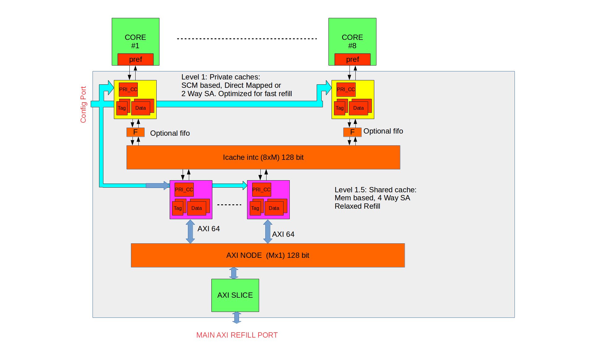

# Structure of the REPO

- README.md
-  RTL
 -  L1.5_CACHE
     - AXI4_REFILL_Resp_Deserializer.sv
     - icache_controller.sv
     - ram_ws_rs_data_scm.sv
     - ram_ws_rs_tag_scm.sv
     - RefillTracker_4.sv
     - REP_buffer_4.sv
     - share_icache.sv
 - L1_CACHE
     - pri_icache_controller.sv
     - pri_icache.sv
 - TOP
     - hier_icache_demux.sv
     - icache128_2_axi64.sv
     - icache_hier_top.sv
 - SIM
     - compile.csh
     - enable_icache_no_prefetch_9th_core_seperation.tcl
     - enable_icache_no_prefetch.tcl
     - enable_icache_with_prefetch_9th_core_seperation.tcl
     - enable_icache_with_prefetch.tcl
     - pulp_interfaces.sv
     - ulpsoc_defines.sv
     - wawe.do
  - TB
     - axi_mem_if.sv
     - generic_memory_with_grant.sv
     - ibus_lint_memory_128.sv
     - l2_generic.sv
     - tb.sv
     - tgen_128.sv

# Description
This Ip implements a 2 Level Instruction caches tailored for Tigthly coupled Processor (Eg Cluster of Processing elements in PULP). It is composed By a private L1 Instruction cache, SCM based with small footprint and  2 way set associative, followed by a central L2 instruction cache, shared among the cores, and tuned for high capacity. The benefit of this IP is to alleviate the timing pressure on the prcessor fetch interface.

# Run
In the SIM folder source the compile script.

```
source ./compile.csh
```

Caches are by default disabled. To control them, a icache control unit is required.
Temporarely, user can enable it forcing the enable req from simulator command line using tcl script:


To enable the ICACHES without L1 to L1.5 prefetch feature
```
source enable_icache_no_prefetch.tcl
```

Self checking logic will check every transaction made.

# Block diagram

